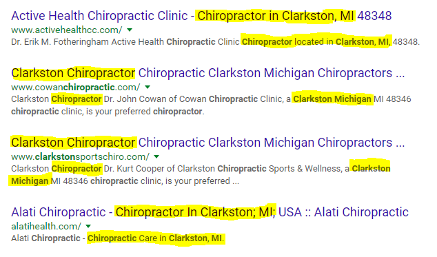
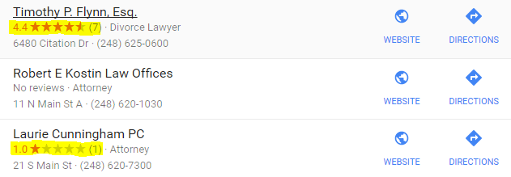

## Quick SEO Tips

A lot of businesses aren’t even aware of what SEO is, or what it can do for them. In today’s technology-driven world, it’s easier than ever to get on the marketing stage. The problem is that anyone can do it, which can drown out the message you’re trying to get to potential customers or clients. Not only do you need to be on the stage, but you also need to be in the spotlight. Without SEO, you’re always going to be playing catch up with your competition. Let’s go over some quick SEO tips for beginners that can help skyrocket your search engine rankings.

_But first…_

## What is SEO (Search Engine Optimization)?

SEO is a marketing practice used to achieve higher organic (non-paid) search engine rankings. Many different tactics and strategies go into an SEO campaign, including Keyword research and implementation, title and content optimization, getting quality websites to link back to you, and much much more.

We could write and endless article going over the complex nature of Search Engine Optimization. But in this article, let’s break down some **quick SEO tips and tricks** for small businesses.

## Keywords

Coming first in our list of quick SEO tips is Keywords. Keywords help search engines identify what your website and content are about. Google’s job is to provide the most relevant content to the people that are searching for it. So for example, if I type in “**Chiropractor in Clarkston MI**“, we’re going to see something that looks like this:

As you can see, these websites have the keywords I searched for in their titles, meta descriptions, and in some cases even their URL. Understanding how people are searching for a service or product is extremely important.

Understanding how your audience is finding you on Google is important. Use a tool like Google Search Console for some **SEO keyword tips** to get a better idea of how and where you’re showing up.

Make sure you’re using Long-tail keywords specific to your business. Long-tail keywords are more lengthy, specific keywords that don’t have a lot of competition. An example of that would be using a keyword like “**Cosmetic Dentist in Clarkston**” as opposed to a broad keyword like “_Dentist_“.

Be cautious not to stuff keywords into your website. Above all, your content, titles, and descriptions should flow naturally, and engage the visitors of your website.

## Write Unique Titles and Meta Descriptions

As mentioned above, using the right keywords in your titles and meta descriptions is a critical part of SEO. You also want to make sure that you do not have duplicate titles or descriptions on any of your pages. Each page on your website serves a unique purpose, and the title and description should reflect that.

You also have various header tags and image alt tags that can be on a page. Making sure your keywords are relevant, and reflect what message you’re trying to get across can make big difference.

## Use Social Media

Social Media is a fantastic tool to use. From Facebook and Twitter to Instagram and Snapchat. Make sure that you have a presence on these outlets so that you are able to connect better with your target audience. But just creating an account is not enough. You need to interact and engage with your audience. You should post regularly, respond to questions and feedback.

There are even tools that allow you to automatically post content to your social media accounts after you create it on your website.

The most successful companies understand the importance of utilizing social media. There have actually been positions created in companies where all they do is interact with people on social media. Crazy right? Well, it works, and they know it.

## Write Good Content Frequently

This one cannot be stressed enough. Writing great content, at least somewhat frequently, will do wonders for your search engine rankings. It will engage your readers by keeping them on your page longer, which is a ranking factor.

Writing good content will also naturally create long-tail keywords. Over time, your content will rank higher which will help the overall ranking of your website.

Make sure you’re utilizing a blog. This will allow you to write more content that is relevant to your business. Writing general content that has nothing to do with what you offer will not do you any good.

## Make Sure Your Website Is Mobile Friendly

If your site isn’t easy to use on mobile, Google penalizes it by ranking it lower on its mobile search results pages. So what, right? Wrong. Mobile internet usage has overtaken desktop, and the gap is only getting bigger. Why? We’ll save that for another article. What’s important is making sure that you’re able to give users (and Google) a good mobile experience. If you have to use two fingers to zoom in on your website’s text or links, then you need to act fast.

The first thing most people do when looking for a product or service near them is pull out their smart phone and search for it. If you are not mobile friendly, chances are that you won’t be appearing in the search results that are displayed to them.

How do you become Mobile Friendly? This may not be something you can do on your own. It would be a good idea to speak with a [professional website design company](http://manawire.com/web-design/ "professional website design company") to assist you with getting your website up to date.

## Use Google's Free Tools

One of the most underrated and underused quick SEO tips is utilizing the many free tools that Google offers to help your website and rankings. Google provides an array of really awesome and useful tools for SEO. Right off the bat, you should claim your business listing on [Google My Business](https://www.google.com/business/ "Google My Business"). Doing this will allow you to specify important information about your business for your visitors to find. Your location, hours, price ranges, photos, and more. You can also manage your Google reviews, which we touch on next.

[Google Analytics](https://www.google.com/analytics/ "Google Analytics") will allow you to track and monitor your website’s traffic. It breaks down your visitor count, your most popular pages, how long visitors are on your website, or how quickly they are leaving. Google Analytics can be a little overwhelming but is a fantastic tool for better understanding user behavior on your website. You will be provided with a tracking code that you can place on your website. If you’re using WordPress then there are plugins that can do this for you. If you’re uncomfortable placing this code on your website, contact a professional website design company to assist you.

[Google Search Console](https://www.google.com/webmasters/ "Google Search Console") (formerly Webmaster Tools) will provide you with a lot of very useful information. You will need to verify your website, a couple simple options are available. With Google Search Console, you can see your Google Ranking for certain keywords, how many impressions you’re getting, and how many clicks for those Keywords. You can also submit your website’s sitemap, allowing Google to crawl and index your site. You can see if you have any HTML errors, crawl errors, structured data, etc. We are in Google Search Console every day because of how much it can tell you about the health of your website. This is a must have for any business website.

## Get Ratings and Reviews

88% of website visitors trust online reviews. Think about it. They don’t know you, or if what you have to offer is going to be any good. What better way to show them than by getting your clients to give you honest reviews. You can have Yelp reviews, Google reviews, Facebook page reviews. They are all important.

**Who you gonna call?** (_hint: not ghostbusters_)

The best way to get new reviews is to simply ask your customers or clients to leave one. We wouldn’t recommend you try and bribe them for reviews either. Creating some sort of promotion incentive for reviews doesn’t really provide you with any real feedback. You want to know that what you’re offering is of value. If it is, then you will get positive reviews.

## Local Business Listings

As mentioned above, reviews can help people decide between you or a competitor. But in order to get these reviews on a wide range listings, you need to make sure you’re on them. Every directory you’re listed on gives you another chance to get found online.

- [Google](https://www.google.com/ "Google")
- [Bing](http://www.bing.com/ "Bing")
- [Yahoo!](https://www.yahoo.com/ "Yahoo!")
- [Yelp](https://www.yelp.com/ "Yelp")
- [Facebook](https://www.facebook.com/ "Facebook")
- [Better Business Bureau](https://www.bbb.org/ "Better Business Bureau")
- [Angie’s List](https://www.angieslist.com/ "Angie’s List")
- [LinkedIn](https://www.linkedin.com/ "LinkedIn")
- [YP.com](https://www.yp.com/ "YP.com")
- [Whitepages](https://www.whitepages.com/ "Whitepages")
- [Foursquare](https://www.foursquare.com/ "Foursquare")

There are quite a few. Be sure to make sure that your NAP (Name, Address, Phone Number) is consistent across these directories.

## Use WordPress

WordPress is a wonderful, free tool that is designed to make how you manage your website easier. A lot of what has been mentioned above can be done via a WordPress plugin. It’s powerful, flexible. secure, and search engine friendly. We recommend using WordPress over [DIY website design](http://manawire.com/blog/6-reasons-avoid-diy-website-builders-business/ "DIY website design") services like Squarespace or Wix. There are also plugins like Yoast SEO that will break down the SEO health of your pages. You can manage your Titles, Meta Descriptions, URL’s, and more. You can specify the keyword you are trying to rank for and it will provide suggestions on where you should place it.

## Make Videos

Closing our list of quick SEO tips is creating videos. Video content is on the rise, and businesses are already jumping all over it. Facebook says that by 2020, [video will account for a majority of content](http://fortune.com/2016/06/14/facebook-video-live/ "video will account for a majority of content"). But why? Well simply put, videos keep people engaged. Videos can provide information that textual content just can’t deliver. You can show someone what you do, while simultaneously telling them. On average, a visitor will stay 2 minutes longer while they watch a video. As we said above, Google takes page visit duration into consideration as a ranking factor. It’s not a coincidence that 87% of online marketers use videos. It just works.

Making videos sounds intimidating, but it’s really not as complicated as it seems. There are services online like Fiverr, where you can have affordable, good looking business videos made. It also may not be a bad idea to get behind your webcam and do some explainer videos, or instructional videos. You can even go live on Facebook, YouTube, and other platforms, and interact with your visitors directly.

## Conclusion

These are just a few of many SEO tactics that you’re able to put in place today. It’s worth noting that these alone will not guarantee the results that you’re looking for. In fact, nothing about SEO is guaranteed. Every business is different, even in the same industry. Every market is also different. Your ranking in search results is going to depend heavily on the competition in your space. The goal is to do something that sets you apart from the rest. If your competitors are reaping the rewards of SEO, it’s important that you create a strategy that does it better.

If you’re serious about creating organic results and sustained traffic to your website, you should reach out to a professional. A [professional SEO company](http://manawire.com/seo/ "professional SEO company") can provide you with a roadmap that will put you on the right path for future growth.
